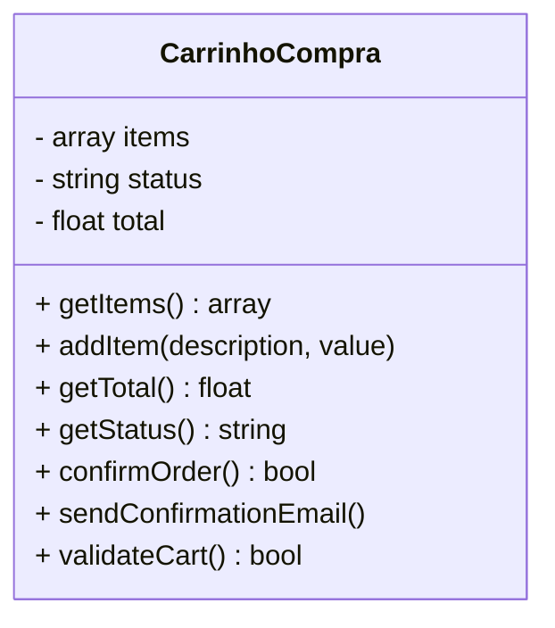
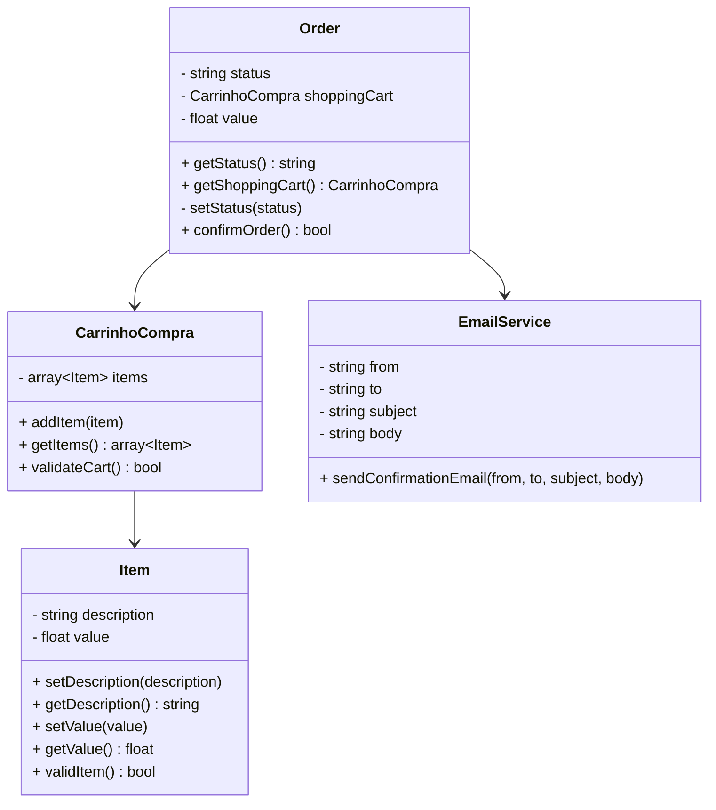

# 🛒 Carrinho de Compras — Princípio da Responsabilidade Única (SRP)

Este projeto demonstra a aplicação do primeiro princípio SOLID — **Single Responsibility Principle (SRP)**. O SRP afirma que uma classe deve ter **apenas uma única responsabilidade**, ou seja, **um único motivo para mudar**.

---

## 💡 Como o SRP foi aplicado?

Antes de aplicar o SRP, a classe `CarrinhoCompra` era responsável por **diversas tarefas**: gerenciar itens, calcular o total, validar o carrinho, finalizar o pedido e até enviar e-mail de confirmação. Isso tornava a classe difícil de entender, manter e testar.

Para aplicar o SRP, cada responsabilidade foi **isolada em sua própria classe**:

- `CarrinhoCompra` → agora apenas gerencia os itens do carrinho.
- `Item` → representa os dados de um item individual.
- `Order` → representa o pedido e lida com o status e regras de finalização.
- `EmailService` → responsável por enviar o e-mail de confirmação.

---

## 🔁 Antes do SRP

## ✅ Depois do SRP

