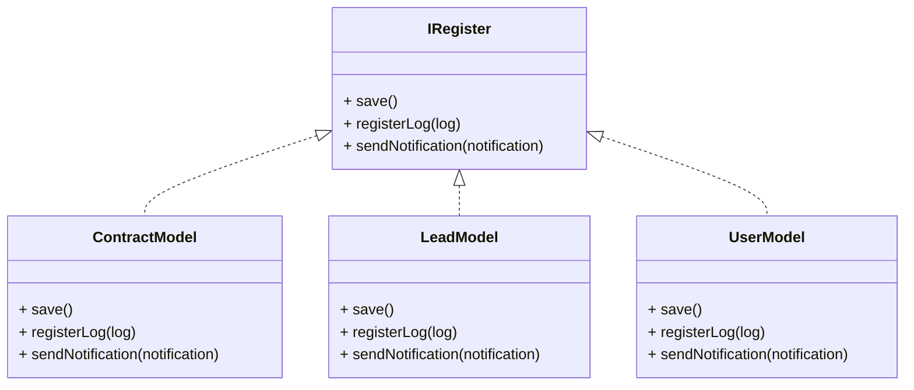
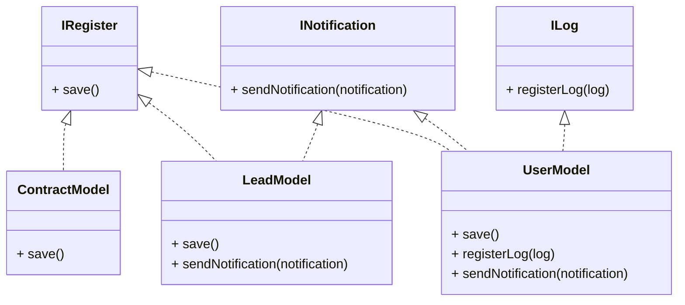

# 🧩 Gestão de Registros — Princípio da Segregação de Interfaces (ISP)

Este projeto demonstra a aplicação do quarto princípio SOLID — **Interface Segregation Principle (ISP)**. O ISP afirma que **nenhum cliente deve ser forçado a depender de métodos que não utiliza**.

---

## 💡 Como o ISP foi aplicado?

Antes de aplicar o ISP, todas as classes (`UserModel`, `LeadModel`, `ContractModel`) implementavam uma única interface `IRegister`, que exigia os métodos `save()`, `registerLog()` e `sendNotification()`. Isso obrigava classes como `ContractModel`, que **não utilizavam log ou notificação**, a depender de métodos desnecessários — violando o ISP.

Após a aplicação do princípio, a interface `IRegister` foi **dividida em interfaces menores e mais específicas**:

- `IRegister` → apenas `save()`
- `ILog` → apenas `registerLog()`
- `INotification` → apenas `sendNotification()`

Agora, cada classe implementa **somente as interfaces relevantes**, mantendo o código coeso e respeitando o ISP.

---

## 🔁 Antes do ISP

## ✅ Depois do ISP

