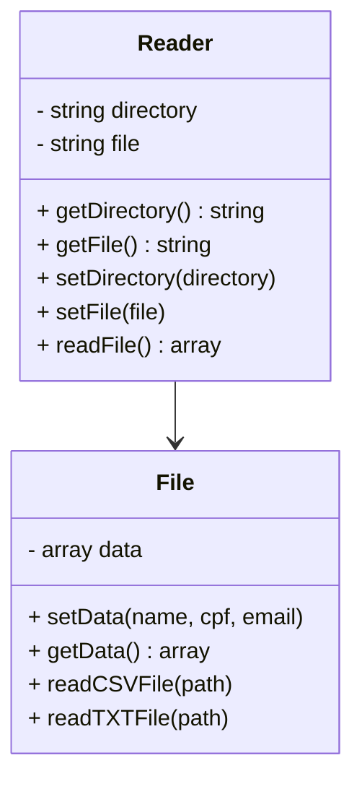
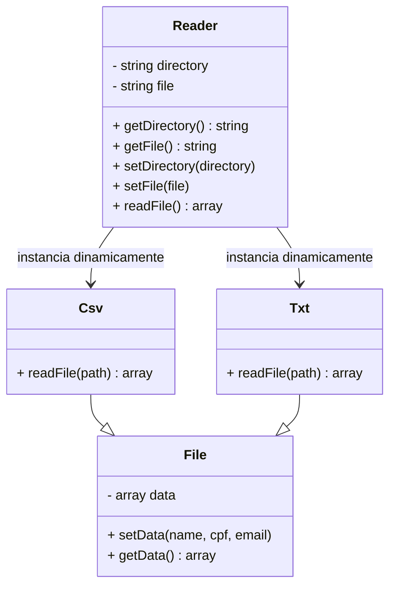

# 📄 ETL de Arquivos — Princípio do Aberto/Fechado (OCP)

Este projeto demonstra a aplicação do segundo princípio SOLID — **Open/Closed Principle (OCP)**. O OCP afirma que **entidades de software devem estar abertas para extensão, mas fechadas para modificação**.

---

## 💡 Como o OCP foi aplicado?

Antes de aplicar o OCP, a classe `File` continha métodos para ler arquivos `.csv` e `.txt`, e a classe `Reader` decidia qual método chamar com base na extensão do arquivo. Isso fazia com que **novos tipos de arquivos exigissem alterações nessas classes**, violando o OCP.

Após aplicar o princípio, cada tipo de leitura foi movido para sua **própria classe**, herdando de uma classe base `File`. Agora, a classe `Reader` utiliza **reflexão dinâmica** para instanciar o leitor correto com base na extensão do arquivo, sem precisar ser modificada para adicionar novos formatos.

- `Reader` → coordena a leitura e instancia dinamicamente a classe de leitura com base na extensão.
- `File` → classe base que armazena os dados lidos e oferece métodos auxiliares.
- `Csv` → lê arquivos `.csv`.
- `Txt` → lê arquivos `.txt`.

---

## 🔁 Antes do OCP

## ✅ Depois do OCP

