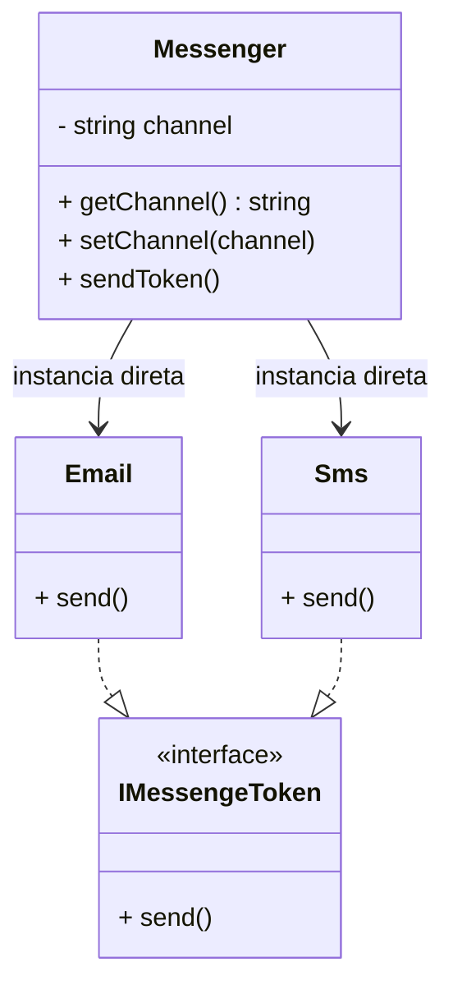
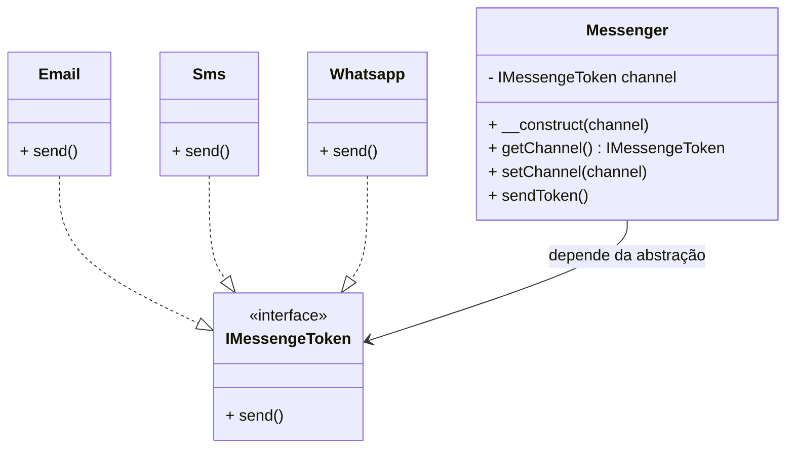

# 📬 Mensageria — Princípio da Inversão de Dependência (DIP)

Este projeto demonstra a aplicação do quinto e último princípio SOLID — **Dependency Inversion Principle (DIP)**. O DIP afirma que **módulos de alto nível não devem depender de módulos de baixo nível. Ambos devem depender de abstrações.** Além disso, **as abstrações não devem depender de detalhes. Os detalhes devem depender de abstrações.**

---

## 💡 Como o DIP foi aplicado?

Antes de aplicar o DIP, a classe `Messenger` era responsável por instanciar diretamente as classes concretas como `Email` ou `Sms`, o que criava um forte **acoplamento** entre o mensageiro e os canais de envio. Isso **quebrava o DIP**, pois a lógica de alto nível (`Messenger`) dependia diretamente de implementações de baixo nível (`Email`, `Sms`).

Após a aplicação do DIP, `Messenger` passou a depender de uma **abstração (`IMessengeToken`)**, e não mais de classes concretas. Agora, é possível injetar qualquer canal de envio que implemente a interface, como `Email`, `Sms` ou até mesmo `Whatsapp`, **sem modificar o código da classe principal**.

---

## 🔁 Antes do DIP

## ✅ Depois do DIP

