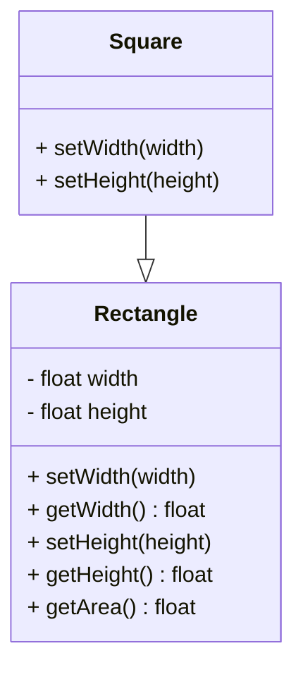
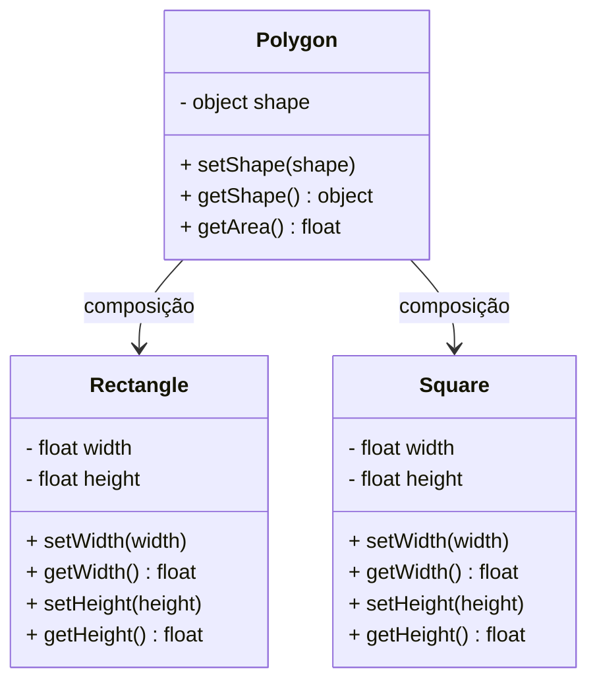

# 📐 Polígonos — Princípio da Substituição de Liskov (LSP)

Este projeto demonstra a aplicação do terceiro princípio SOLID — **Liskov Substitution Principle (LSP)**. O LSP afirma que **classes derivadas devem poder ser substituídas por suas classes base sem alterar o comportamento esperado do programa**.

---

## 💡 Como o LSP foi aplicado?

Antes de aplicar o LSP, a classe `Square` herdava de `Rectangle`, mas sobrescrevia os métodos `setWidth()` e `setHeight()` de forma que alterava o comportamento original da classe pai. Isso causava **resultados inesperados ao calcular a área**, especialmente quando uma instância de `Square` era usada como se fosse `Rectangle`.

Para corrigir isso, foi criada uma **classe intermediária `Polygon`**, que espera um objeto com os métodos `getWidth()` e `getHeight()`. Agora, `Rectangle` e `Square` **não estão mais relacionadas por herança direta**, mas sim por **composição via interface esperada por `Polygon`**, respeitando o LSP.

- `Polygon` → calcula a área a partir de qualquer forma que implemente `getWidth()` e `getHeight()`.
- `Rectangle` → define e retorna altura e largura livremente.
- `Square` → mantém altura e largura iguais, sem violar o contrato da composição.

---

## 🔁 Antes do LSP

## ✅ Depois do LSP

